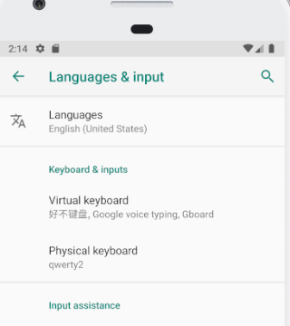
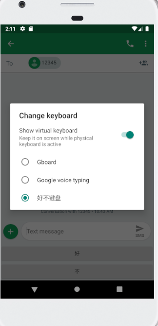
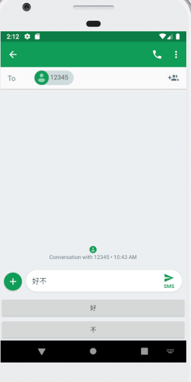

## 好不键盘

此项目仅为演示如何创建一个最简单的安卓键盘.

四年多前, 有过一次无果而终的头脑风暴. 其中的一个副产品是一个安卓键盘, 功能很简单, 只能输入 yes 或者 no.

这里借用此想法, 原型实现比想象中的更简单.

### 实现

开发环境: Android Studio 3.5.3, JRE 1.8.0_202, SDK API 28.

创建项目, 选择"Phone and Tablet -> Add No Activity".

在`manifests/AndroidManifest.xml`中添加输入法服务, 好像必需一个`xml/method`资源.

再添加对应的 Java 代码:
```java
public class 好不键盘 extends InputMethodService {

    @Override
    public View onCreateInputView() {
        final LinearLayout 布局 = new LinearLayout(this);
        布局.setOrientation(LinearLayout.VERTICAL);
        布局.addView(创建按键("好"));
        布局.addView(创建按键("不"));
        return 布局;
    }

    private Button 创建按键(final String 字) {
        Button 按键 = new Button(this);
        按键.setText(字);
        按键.setOnClickListener(new View.OnClickListener() {
            @Override
            public void onClick(View view) {
                getCurrentInputConnection().commitText(字, 1);
            }
        });
        return 按键;
    }

}
```

详见[此 commit](https://github.com/program-in-chinese/demo_android_input_yes_no/commit/21b6389de070998e050ca17b5b3b5eb417501f90)

### 测试

在 API 28 的 Pixel XL 模拟器中测试(也在安卓 7.0 的真机中运行过).

首先添加此虚拟键盘:



在输入时选择输入法:



按键就输入单字:



#### 参考

安卓官方[示例输入法项目](https://github.com/android/input-samples/tree/master/CommitContentSampleIME)